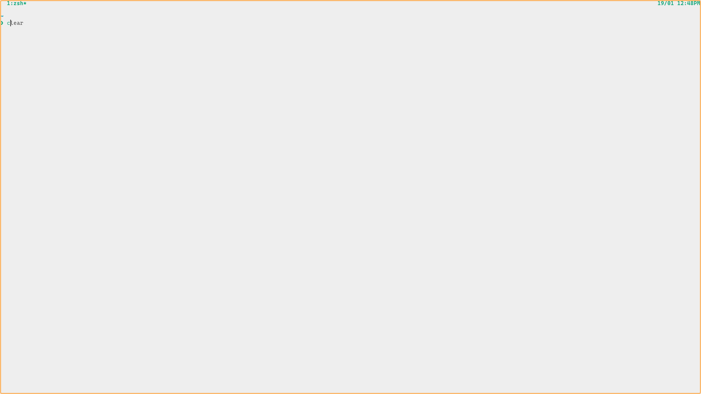

# My dot files

## Requirement

- Neovim ≥ 0.5
- [vim plug](<https://github.com/junegunn/vim-plug>)

## Demo

**You can watch my Talk show Oct 15, 2021: my setup for coding, daily use**

⇒ <https://youtu.be/2OhzSP1uGLc>

---

## Feature

- zsh
  - fzf, moving fast.
    - in cli press `f` edit file with nvim
    - in cli press `c` cd to dir, clear screen and fancy ls
  - Auto switch (dark | light) theme
    - using `dark | light` in command line
    - change nvim & kitty & batcat theme
- Tmux:
  - auto save, continuum session
  - switch session quickly with fzf
- Vim:
  - zet note support using vim, [see function](https://github.com/thuanpham2311/dotfiles/blob/master/nvim/after/plugin/zet.vim)
  - vim keymap everywhere
    - i use [touchcursor](https://github.com/donniebreve/touchcursor-linux) for config my keyboard, older is use xmodmap but i have some issue with this then i switch to touchcursor and this work well
    - my touchcursor config [here](https://github.com/thuanpham2311/dotfiles/blob/master/touchcursor/touchcursor.conf)
- [Using vim keymap everywhere use hold space with touchcursor](<https://github.com/thuanpham2311/touchcursor-vim>)

## You want setup like me?

[https://github.com/thuanpham2311/linux_setup](https://github.com/thuanpham2311/linux_setup)

## Contributing workflow

Here’s how we suggest you go about proposing a change to this project:

1. [Fork this project][fork] to your account.
2. [Create a branch][branch] for the change you intend to make.
3. Make your changes to your fork.
4. [Send a pull request][pr] from your fork’s branch to our `master` branch.

[fork]: https://help.github.com/articles/fork-a-repo/
[branch]: https://help.github.com/articles/creating-and-deleting-branches-within-your-repository
[pr]: https://help.github.com/articles/using-pull-requests/
